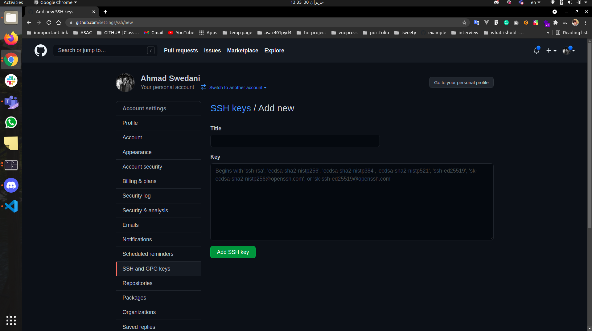

# setup js :
1. get last ver for win10 or win11
2. In the Search box next to the Windows Menu, type Turn Windows Features On Or Off and hit enter.
A window will pop up with a list of folders with checkboxes next to them.
Scroll down and check the boxes for:
- [x] Virtual Machine Platform
- [x] Windows Hypervisor Platform
- [x] Windows Subsystem for Linux
- [x] for amd Cpu restart your pc and turn on svm and tpm from the bios svm for Virtual Machine work and tpm for win 11 
3. instal Windows Terminal from the store
4. Enter the following command to set your system default to WSL 2:`wsl --set-default-version 2` in powershell
5. Download the latest package:
`https://wslstorestorage.blob.core.windows.net/wslblob/wsl_update_x64.msi` for
WSL2 Linux kernel update package for x64 machines, Install the Ubuntu with no numbers app from the Windows Store  it will ask for username and password 
6. Open Command Prompt from the Windows search bar
Run the following command: `wsl -l -v` 
it will show :
 ``` 
PS C:\Users\yourname> wsl -l -v
NAME                   STATE           VERSION
Ubuntu-20.04           Running         2 
```

7. Set Ubuntu as the default when opening the windows terminal. from sitting of the windows terminal.

8. now all steps from ubuntu root

9. Make back ups of the files listed below. You may get a No such file or directory error for some of them. That’s ok.:
```
mv ~/.bashrc .bashrc.bak
mv ~/.bash_profile .bash_profile.bak
mv ~/.profile .profile.bak
mv ~/.zshrc .zshrc.bak
```

10. run `curl -s https://raw.githubusercontent.com/codefellows/setup-guide/main/configs/.profile >> ~/.profile`

11. run `source ~/.profile`

NOTE: You will see an error along the lines of -bash: /home/linuxbrew/.linuxbrew/bin/brew: No such file or directory. This is ok for now.

12. Type `sudo apt-get update`
- Provide your password, when prompted
- Once that is complete, type `sudo apt-get upgrade` Press y when prompted.
- Once that is done, type `sudo apt autoremove` This will remove any packages that are no longer needed.
- Install the “Build Essentials” kit with this command: `sudo apt-get install build-essential`

13. Install “Homebrew” run `/bin/bash -c "$(curl -fsSL https://raw.githubusercontent.com/Homebrew/install/master/install.sh)"`
go contunuo and yes anything
14. run `test -d ~/.linuxbrew && eval $(~/.linuxbrew/bin/brew shellenv)`
15. run `test -d /home/linuxbrew/.linuxbrew && eval $(/home/linuxbrew/.linuxbrew/bin/brew shellenv)`
16.  run `brew doctor` return output is: Your system is ready to brew
17. run `brew update`
18.  run `brew install gcc`
19. Run `brew install nvm` 
20. Once it completes, you will need to exit your terminal, and log back in to demonstrate that the command works in a new shell. You will then need to ensure you have a hidden folder for nvm. Run the following: `mkdir ~/.nvm`
21. run `nvm install --lts`
22. run `nvm ls` Your output should look similar to this (version numbers may differ):
```
->     v14.16.1
iojs -> N/A (default)
unstable -> N/A (default)
node -> stable (-> v14.16.1) (default)
stable -> 14.16 (-> v14.16.1) (default)
lts/* -> lts/fermium (-> v14.16.1)
lts/argon -> v4.9.1 (-> N/A)
lts/boron -> v6.17.1 (-> N/A)
lts/carbon -> v8.17.0 (-> N/A)
lts/dubnium -> v10.24.1 (-> N/A)
lts/erbium -> v12.22.1 (-> N/A)
lts/fermium -> v14.16.1
```
23. run `node --version`
24. run `node` type 5+5 The result should be 10. If you get 11 your computer is broken. ;)  Quit node by pressing control C two times.

25. get setup : run `brew install git || brew upgrade git`
26. run `brew install gh`
27. run `gh auth login`
28. Use arrow key to select GitHub.com
29. Select HTTPS
30. When prompted with Authenticate Git with your GitHub credentials (Y / n). Press y and enter
40. Click Login with a web browser
41. Copy the one time code shown in yout terminal and then press enter. This will open github.com in a web page.
42. If not signed in, you will be prompted to signin.
43. Github will prompt you for the one time code. Enter in the appropriate boxes.
44. Click Authorize github
45. You can close the web browser and press enter in your terminal to continue.
```
Like artists, programmers sign their work. Let’s configure Git to sign your commits with your name and email address.

WARNING: Before running the following commands one line at at time, replace YOUR FULL NAME and YOUR EMAIL ADDRESS with the name and email from Your GitHub Account

git config --global user.name 'YOUR FULL NAME'
git config --global user.email 'YOUR EMAIL ADDRESS'
git config --global core.editor "code --wait"
git config --global init.defaultbranch main

```
46. run `brew install tree`
47. run `tree --version`

48. run `npm install -g live-server`
49. run `live-server --version`
50. run `npm install -g eslint`
51. run `eslint --version`
52. install vscode from the web and install these extensions:
- liveserver
- ESLint
- markdownlint
- HTML Preview

53. vs Code extensions:

Table of Contents
Want to install all of the extensions listed below at once?! Check out The `Web Development Essentials Extension`
1. Debugger for chrome
2. Javascript (ES6) Code Snippets
3. ESLint
4. Live server
5. Bracket Pair Colorizor
6. Auto Rename Tag
7. Quokka
8. Path Intellisense
9. Project Manager
10. Editor Config
11. Sublime Text Keymap
12. Browser Preview
13. Git Lens
14. Polacode
15. Prettier
16. Better Comments
17. Git Link
18. VS Code Icons
19. Material Icon Theme
20. Settings Sync
21. Better Align
22. VIM


### 301 setup :
1. run `brew install postgresql`
2. run `pg_ctl -D /home/linuxbrew/.linuxbrew/var/postgres start`
3. run `echo 'alias pgstart="pg_ctl -D /home/linuxbrew/.linuxbrew/var/postgres start"' >> ~/.profile` 
4. run `echo 'alias pgstop="pg_ctl -D /home/linuxbrew/.linuxbrew/var/postgres stop"' >> ~/.profile`
5. you need to restart the terminal From this point onward, you can simply run `pgstart` or `pgstop` to start and stop your postgres server 

```
Create your "user" database
Once the server is up and running, we'll need to create a default database for our user. Run this command:

createdb `whoami`
Validate that postgres clients can connect
Now, let's make sure we can connect to the postgres server. Run this command:

psql
You should see something similar to the following:

psql (12.3)
Type "help" for help.

yournamehere=#
Type \q to exit the postgres client application and return to your bash shell.


```


# Set Up 401 python

## Prerequisites

**IMPORTANT:** Make sure you've completed the Code Fellows [Basic Computer Setup](https://codefellows.github.io/setup-guide){:target="_blank"} Guide


## Update Terminal/Environment

Make a back up of existing '.profile'

```bash
mv ~/.profile ~/.profile.bak
```

Create new `~/.profile` and add text below

```bash
#Linuxbrew (if needed)
if [ -d /home/linuxbrew ]; then
  eval $(/home/linuxbrew/.linuxbrew/bin/brew shellenv)
fi

#NVM
if [ -f $(brew --prefix nvm)/nvm.sh ]; then
  source $(brew --prefix nvm)/nvm.sh
fi

# Python
if command -v pyenv 1>/dev/null 2>&1; then
  eval "$(pyenv init -)"
fi

```

## Install Zsh

**Note:** this section has OS specific steps

### WSL/Linux
```console
sudo apt-get install zsh
```

### Mac

```console
brew install zsh
chsh -s /usr/local/bin/zsh
```

## Oh My Zsh


Once Zsh has been installed let's give it super powers by adding `oh-my-zsh`

```console
sh -c "$(curl -fsSL https://raw.github.com/ohmyzsh/ohmyzsh/master/tools/install.sh)"
```

Say `yes` if asked if you want to make zsh the default shell.

Last thing to do is to add instructions to load your profile.

Enter the text below in terminal.

```console
cat >> ~/.zshrc<<EOF

# Source .profile, if present.
if [ -f "$HOME/.profile" ]; then
  source "$HOME/.profile"
fi
EOF
```

Oh My Zsh is a very handy and powerful tool. Checkout the [Cheat Sheet](https://github.com/ohmyzsh/ohmyzsh/wiki/Cheatsheet) if you're interested

## Install Python Tools

- Mac
  - `xcode-select --install`
  - `brew install openssl readline sqlite3 xz zlib`
- WSL/Linux
  - `brew install bzip2 libffi libxml2 libxmlsec1 openssl readline sqlite xz zlib`
- `brew install pyenv`
- `pyenv install 3.9.4`
  - This command downloads and builds Python interpreter
  - In case of failure
    - WSL/Linux: Refer to [Pyenv Common Problems](https://github.com/pyenv/pyenv/wiki/Common-build-problems){:target="_blank"} and run the `apt-get` command at top of page under the **Ubuntu/Debian** section.
    - Mac: Make sure the Mac specific steps above were followed.
- `pyenv global 3.9.4`
- `python --version`
  - If error then restart terminal
- `brew install poetry`
- `brew install nvm`
  - If this fails you can install nvm by runinng:
  ```bash
  curl -sL https://raw.githubusercontent.com/nvm-sh/nvm/v0.38.0/install.sh -o install_nvm.sh
  
  bash install_nvm.sh
  ```
  - Then replace you [.profile with this one](./.profile) and run `source ~/.profile`
  - `nvm --version`
- `poetry config virtualenvs.in-project true`
  - If error then restart terminal
- `poetry new python-fun`
- `cd python-fun`
- `poetry shell`
- `poetry install`
- `poetry add matplotlib jupyterlab`
- `pytest`


If no commands failed then you're all done.

## Test Jupyter Notebook and Matlab
-  `jupyter lab`

Open the url in the brower and create a new notebook. Test with any sample python code:

```python
import matplotlib.pyplot as plt
import numpy as np
x = np.linspace(0, 20, 100)  # Create a list of evenly-spaced numbers over the range
plt.plot(x, np.sin(x))       # Plot the sine of each x point
plt.show()                   # Display the plot
```


# Quokko extenstion fix :

1. you must be in root ~
2. Run `brew install nvm`  or `reinstall` or download node from offical site if not work with actuly its the better to download it also from the site.
3. Once it completes, you will need to exit your terminal, and log back in to demonstrate that the command works in a new shell. You will then need to ensure you have a hidden folder for nvm. Run the following: `mkdir ~/.nvm`
4. run `nvm install --lts`
5. run `nvm ls` Your output should look similar to this (version numbers may differ):
6. type node and type 5+5 and see if its work fine.


# SSH-GitHub

## setup SSH keys


### Terminal part:

1- First open the terminal:

2- Create new SSH key using this command , and copy the key

```
cd && ssh-keygen && cat ~/.ssh/id_rsa.pub
```
- press enter three times


### GitHub part:

1- open [GitHub setting Keys](https://github.com/settings/keys)


2- click on `New SSH key` you will see this result:



3- write `ssh-terminal` in the title section

4- paste the key that we copied before in the Key section


5- click on `Add SSH key` you will see this result: 


--- 

### Enjoy using SSH no password any more 😎 🥳:

> clone with SSH URL 

---

### `Important`: to change the remote from Https to SSH:

open your repo and run this command

```
git remote set-url origin SSH-URL
```

### Done


